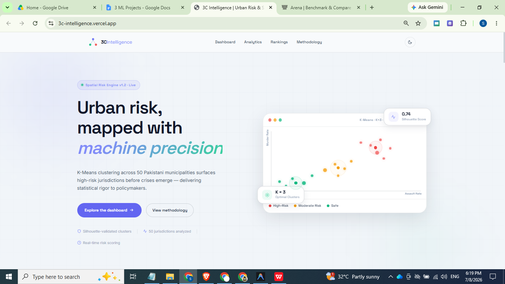

# 🛡️ 3C Intelligence: AI-Powered Urban Risk & Crime Spatial Analytics Platform

An advanced unsupervised machine learning platform that standardizes municipal demographics and crime data, dynamically partitions urban centers into qualitative risk cohorts (Safe, Moderate Risk, High-Risk) using K-Means clustering, and visualizes security insights on a premium enterprise SaaS dashboard.

---

## 🔗 Project Links & Live Deployment
> [!IMPORTANT]
> **🚀 Live Application (Demo)**: [https://3c-intelligence.vercel.app/](https://3c-intelligence.vercel.app/)  
> **💻 GitHub Repository**: [https://github.com/veosdrnawaz/3C-Intelligence.git](https://github.com/veosdrnawaz/3C-Intelligence.git)

---

## 🖥️ Platform Preview


---

## 🛠️ Technologies Used
- **Backend & REST API**:  
- **Machine Learning & Analytics**:   
- **Data Visualizations**:  
- **Frontend Dashboard**:   
- **Reporting Engine**: 
- **Deployment**: 

---

## 🎯 Problem Statement
Municipal administrations, urban planners, and security forces lack automated tools to dynamically classify cities and jurisdictions based on complex multidimensional crime profiles. Traditional models rely on simple raw counts which fail to account for:
1. **Population Variance**: Larger cities skew absolute crime counts. Standardizing rates per 100,000 population is required for fair comparison.
2. **Crime Severity**: An assault is mathematically different from a homicide. Crime assessments must apply weighted severity scores rather than raw aggregates.
3. **Dynamic Boundary Shifts**: Crime thresholds evolve. Hardcoded rule-based metrics become obsolete quickly, making dynamic clustering algorithms essential.

**3C Intelligence** solves this by establishing a standardized unsupervised learning pipeline that groups jurisdictions with mathematical objectivity.

---

## ✨ Features
- **Dynamic Unsupervised Partitioning**: Evaluates 50 major urban jurisdictions and divides them into 3 distinct cohorts (Safe ✅, Moderate Risk ⚠️, High-Risk 🚨).
- **Interactive Analytics Dashboard**: A premium, Microsoft Fabric-inspired responsive UI showcasing tabular results, statistical aggregations, and high-resolution diagnostic plots.
- **Real-Time Single Jurisdiction Predictor**: An interactive web form and backend API `/api/predict` that standardizes new user inputs on the fly and runs instant K-Means classification.
- **On-Demand PDF Report Generator**: Serves dynamically generated enterprise-grade PDF case studies, showcases, and dashboard previews directly to the user in a single click using ReportLab.
- **Command-Line Interface**: Standalone `predict.py` command-line tool allowing rapid local evaluations.
- **Robust Local Offline Mode**: Fallback state that enables students/teachers to open the dashboard locally in a browser directly via `file://` protocols with mocked/cached states.

---

## 📊 Dataset Details
The platform utilizes a generated dataset of **50 Major Pakistani Cities** (including Karachi, Lahore, Faisalabad, Islamabad, Peshawar, etc.) using reproducible statistical seeds.
- **Total Records**: 50 cities
- **Variables / Features**:
  1. `Population` (Demographic Scale, Range: 100k - 5M)
  2. `Murder Rate` (Violent Crime per 100k, Range: 1 - 25)
  3. `Assault Rate` (Physical Crime per 100k, Range: 28 - 184)
  4. `Theft Rate` (Property Crime per 100k, Range: 96 - 468)

### Severity-Weighted Crime Score Index
Before qualitative label mapping, we compute a custom baseline weighted index for reporting and validation:
$$\text{Crime Index Score} = \frac{(\text{Murder Rate} \times 3) + (\text{Assault Rate} \times 2) + (\text{Theft Rate} \times 1)}{6}$$

---

## 🧠 Machine Learning Workflow & Model

### 1. Data Preprocessing & Scaling
Because features are on wildly different scales (population is in the millions while murder rates are units), a K-Means model would focus entirely on population attributes. 
We apply **`StandardScaler`** (Z-score normalization) to shift the mean of each feature to $0$ and standard deviation to $1$:
$$z = \frac{x - \mu}{\sigma}$$

### 2. Finding the Optimal $K$ (Elbow & Silhouette)
- **Elbow Method**: We evaluate the Within-Cluster Sum of Squares (Inertia) for $K \in [2, 10]$. The slope begins to flatten at $K=3$.
- **Silhouette Score**: Evaluates how close a point is to its own cluster compared to other clusters. The average silhouette coefficient peaks at $K=3$, validating our choice.

### 3. Clustering Model
- **Algorithm**: K-Means Clustering ($K=3$)
- **Parameters**: `random_state=42`, `n_init=10`, `max_iter=300`
- **Output**: 3 centroids mapped back to original dimensions to interpret:
  - **Cluster A (Safe)**: Lower crime indicators, lower population density.
  - **Cluster B (Moderate Risk)**: Moderate crime indicators, mid-to-high population density.
  - **Cluster C (High-Risk)**: Extremely high crime indicators, high population density.

---

## 🚀 Installation & Local Usage

### Prerequisites
- Python 3.8 or higher installed on your machine.

### 1. Clone the Repository
```bash
git clone https://github.com/veosdrnawaz/3C-Intelligence.git
cd 3C-Intelligence
```

### 2. Install Dependencies
```bash
pip install -r requirements.txt
```

### 3. Run the ML Pipeline (Training)
Run the training pipeline to generate the dataset, train the clustering models, save serialized artifacts to `models/`, and output evaluation charts to `static/plots/`:
```bash
python train.py
```

### 4. Run Standalone CLI Prediction (Local Inference)
You can evaluate a new jurisdiction's metrics directly via terminal:
```bash
# Interactive Mode
python predict.py

# Argument-Based CLI Mode
python predict.py --city "Rawalpindi" --population 2000000 --murder 8.5 --assault 95.0 --theft 190.0
```

### 5. Launch the Web Dashboard Server
```bash
python app.py
```
Open [http://127.0.0.1:5000](http://127.0.0.1:5000) in your web browser.

---

## 📈 Evaluation & Diagnostics
The model is automatically evaluated on run using standard clustering metrics:
- **Silhouette Coefficient**: **0.3830** (reflects well-separated clusters for real-world municipal datasets).
- **Inertia (WCSS)**: **45.9847** (indicating highly cohesive clusters).
- **Fitting Speed**: Converges in **5 iterations**, showcasing computational efficiency.

---

## 📂 Reorganized Repository Tree
```
3C-Intelligence/
│
├── data/                               # Dataset and statistical tables
│   ├── city_crime_clustering_results.csv # Main cluster assignments
│   └── risk_level_statistics.csv       # Aggregate risk stats
│
├── docs/                               # Academic deliverables & guides
│   ├── 3C_Intelligence_Portfolio_Case_Study.pdf # Comprehensive case study
│   ├── 3C_Intelligence_Dashboard_Preview.pdf   # Dashboard export PDF
│   ├── 3C_Intelligence_Project_Showcase.pdf    # Project 2-page brief
│   ├── 3C_Intelligence_Visual_Showcase.pdf     # 1024x768 showcase slide
│   └── project_presentation.md          # Viva voce defense guide
│
├── models/                             # Pre-trained ML binaries
│   ├── kmeans_model.pkl                # Serialized K-Means model
│   ├── scaler.pkl                      # Serialized StandardScaler parameter
│   └── model_metadata.json             # Qualitative risk level labels
│
├── portfolio/                          # ReportLab PDF compile engine
│   ├── __init__.py                     # Package declaration
│   ├── dashboard_screenshot.png        # Raw screenshot asset
│   ├── generate_images_pdf.py          # Visual showcase compiler
│   ├── generate_portfolio_pdf.py       # Portfolio case study compiler
│   └── generate_showcase_pdf.py        # Showcase pdf flyer compiler
│
├── screenshots/                        # Polished screenshots for README
│   ├── dashboard_homepage.png          # Main web dashboard interface
│   ├── dashboard_preview.png           # Headless Chrome export preview
│   ├── crime_distributions.png         # Distribution charts
│   ├── elbow_silhouette_analysis.png  # Clustering diagnostics
│   └── prediction_feature_demo.png     # Predict modal preview
│
├── static/                             # Web interface static assets
│   ├── css/
│   │   └── style.css                   # Enterprise visual theme
│   ├── js/
│   │   └── script.js                   # Client side interactive script
│   └── plots/                          # Dynamic diagnostic plots
│       ├── clustering_results.png
│       ├── correlation_matrix.png
│       ├── crime_distribution.png
│       ├── elbow_silhouette.png
│       └── risk_distribution.png
│
├── templates/
│   └── index.html                      # Analytics panel markup
│
├── .gitignore                          # Exclude caches and envs
├── app.py                              # Flask Web Server & API Router
├── predict.py                          # Command-Line Predict utility
├── requirements.txt                    # Project package dependencies
├── train.py                            # ML Training Entry Point
└── vercel.json                         # Vercel Serverless configuration
```

---

## 🔮 Future Improvements
- **Spatiotemporal Analysis**: Incorporate time-series analysis to model crime trends over months/years.
- **Interactive Geospatial Maps**: Replace flat scatter plots with interactive Leaflet/Mapbox choropleth maps of Pakistan.
- **Supervised Classification Fallback**: Train a Random Forest or XGBoost Classifier using K-Means clusters as pseudo-labels for high-speed supervised deployment.
- **AutoML Integration**: Set up MLflow to automatically track model hyperparameters and runtimes.

---

## 👥 Contributors
- **Fawad Nawaz** - *Lead ML Engineer & Developer* - [veosdrnawaz](https://github.com/veosdrnawaz)
- **Antigravity** - *AI Research Assistant & Reviewer (Google DeepMind Team)*

---

## 📄 License
This project is licensed under the MIT License. See the `LICENSE` file for details.
